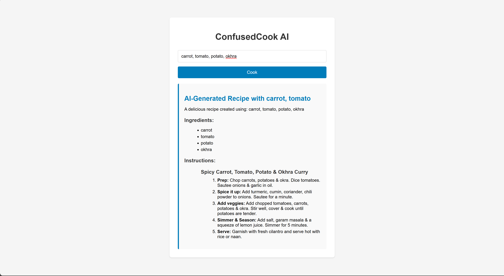

# ConfusedCook-ai

ConfusedCook-ai is an intelligent recipe assistant app that helps users discover, generate, and manage recipes using AI.


## Features

- AI-powered recipe generation
- Search and filter recipes
- User-friendly interface

## Prerequisites

Before running the app locally, make sure you have the following installed:

- [Git](https://git-scm.com/downloads)
- [Python 3.8+](https://www.python.org/downloads/)

## Getting Started

1. **Clone the repository**

   Open your terminal or command prompt and run:
   ```bash
   git clone https://github.com/VaradaNambiar/ConfusedCook-ai.git
   cd ConfusedCook-ai
   ```

2. **Install dependencies**

   ```bash
   python -m venv venv
   source venv/bin/activate   # On Windows: venv\Scripts\activate
   pip install -r requirements.txt
   ```

3. **Set up environment variables**

   Create a .env file with ```GROQ_API_KEY=<your_key>``` in it

4. **Run the app locally**
   ```bash
   python ui\flask_server.py runserver
   ```

5. **Open the app in your browser**

   Visit [http://localhost:3000](http://localhost:3000) or [http://localhost:5000](http://localhost:5000), depending on where falsk server sets it up (check the details in your terminal).


## Contributing

Pull requests are welcome! For major changes, please open an issue first to discuss what you would like to change.

## License

This project is licensed under the MIT License.

---

If you have questions, feel free to open an issue or reach out to me.


